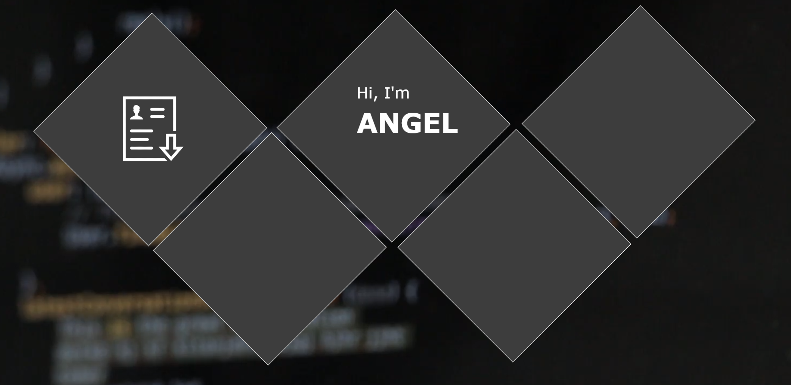

# PortfolioWebsite
<b> Languages Used: </b> JavaScript, HTML, CSS

This project was created as a means for me to present myself professionally online in front the the public and potential employers.
It includes information such as my resume, general information about me, my contact, and a description of other sideprojects I have 
done and am currently working on.

<b>Goal:</b>

My main goal throughout this project was to learn in-depth about front-end/web development. I know the best way for me to learn is 
to challenge myself and so I decided to create a unique and fully reactive website. Instead of a simple one-page inforgraphic style
portfolio website, I decided that I would make a truly appealing design that would not only amaze the viewer, but also motivate me to 
go out of my way and learn the different tips and tricks of HTML/CSS.

<b> Currently, the overall design and framework of the website is finished and can be seen as the website is online, though the information
still needs to be filled out.
  
  

